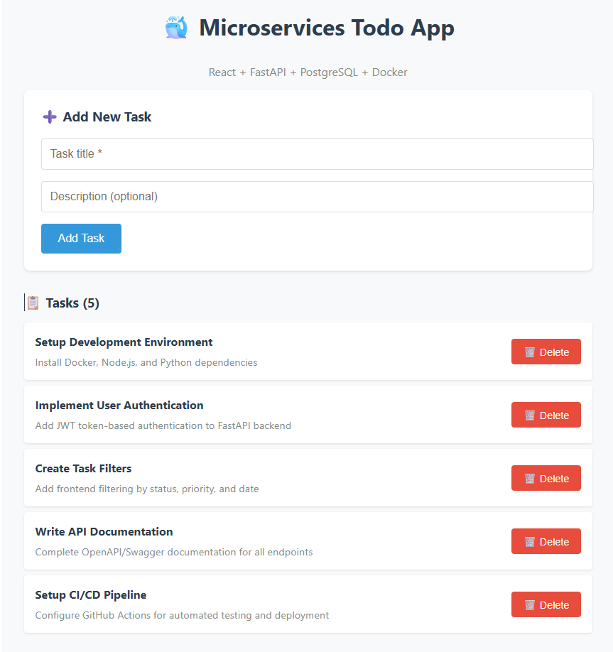

# Indications Projet Microservices

## 1. Arborescence

## 1. Structure détaillée (implémentation de référence)

Voici l'arborescence complète de l'implémentation fournie :
```
microservices/                   # Dossier racine du projet
│
├── backend/                     # Service API backend
│   ├── app/                     # Code source de l'application
│   │   ├── __init__.py          # Module Python
│   │   └── main.py              # Point d'entrée FastAPI
│   ├── Dockerfile               # Image Docker backend
│   └── requirements.txt         # Dépendances Python
│
├── frontend/                    # Service interface utilisateur
│   ├── Dockerfile               # Image Docker frontend
│   ├── webapp/                  # Configuration web
│   │   ├── index.html           # Page HTML principale
│   │   ├── package.json         # Dépendances Node.js
│   │   ├── vite.config.js       # Configuration Vite
│   │   └── nginx.conf           # Configuration serveur nginx
│   └── src/                     # Code source React
│       ├── main.jsx             # Point d'entrée React
│       └── App.jsx              # Composant principal
│
├── database/                    # Service base de données
│   ├── Dockerfile               # Image Docker PostgreSQL
│   └── init.sql                 # Script d'initialisation DB
││
├── secrets/                     # Secrets Docker
│   └── db_password              # Mot de passe base de données
├── docker-compose.yml           # Orchestration des services
├── README.md                    # Documentation principale
└── .env                         # Variables d'environnement
```

## 2. Build & Démarrage

```bash
docker compose up --build -d
docker compose ps
```
Les trois services doivent devenir `(healthy)`.

```bash
docker compose logs --tail 50 db
docker compose logs --tail 50 backend
docker compose logs --tail 50 frontend

# Tester la santé des services
curl http://localhost:8000/health
curl http://localhost:3000/health
```


- Backend : http://localhost:8000
- Backend docs : http://localhost:8000/docs
- Backend santé : http://localhost:8000/health
- Frontend : http://localhost:3000


## 3. Interface Frontend Attendue

Voici un exemple de la page d'accueil du frontend affichée :



L'interface doit contenir :
- Titre de l'application
- Formulaire avec des champs de saisie
- Bouton "Add" pour soumettre
- Liste les objets existants

## 4. Variables et Configuration

- `POSTGRES_USER` / `POSTGRES_DB` : via `.env` (`DB_USER`, `DB_NAME`)
- Mot de passe DB : `secrets/db_password` (monté `/run/secrets/db_password`)
- Backend lit le secret via `DB_PASSWORD_FILE`
- Frontend build : `VITE_API_URL` injecté ARG/ENV

---